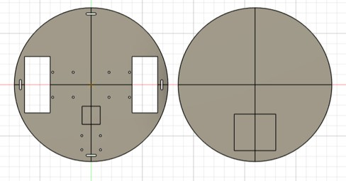
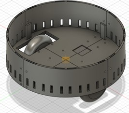
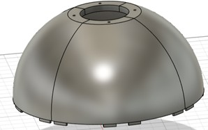
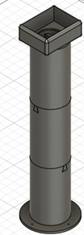
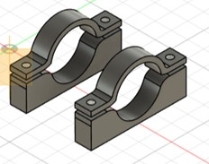

## Mechanical Design Overview

The mechanical design of our autonomous robot was meticulously crafted using **Fusion 360**, with a focus on modularity, printability, and spatial efficiency. Each component was tailored to fit within real-world manufacturing constraints while maintaining the structural integrity and aesthetic of the robot.

---

### Chassis and Base Structure

We began the design process with a **15-inch diameter circular base**, providing a stable platform large enough to house the motors, power supply, and control electronics. Precise **mounting holes and cutouts** were integrated to accommodate key components such as:

- Dual GoBilda motors  
- Battery pack  
- Main PCB and wiring channels
- Jetson Orin Nano
- Esp32  

  

---

### Wall Assembly

To provide **structural rigidity** and **perimeter protection**, a custom cylindrical wall was designed to enclose the base. This wall includes ventilation slots and alignment features for easy integration with the dome.

  

---

### Dome Design

To increase internal volume while ensuring a compact and aerodynamic profile, a **dome-shaped roof** was implemented. A central opening was included for cable routing and component mounting. This component was **segmented** for 3D printability using **Bambu Studio**, with custom connectors allowing seamless post-print assembly.

  

---

### Vertical Tube Mount

Attached to the dome is a **3-inch diameter vertical tube** that supports a servo-driven camera mount at its top. The tube is split into sections using **dovetail joints**, allowing for secure sliding assembly. Once aligned, these sections were bonded permanently using super glue for a rigid extension.

  

---

### Custom Motor Mounts

We designed custom-fit **motor brackets** tailored for the GoBilda motors to ensure solid placement and vibration isolation. These mounts provided adequate clamping force and were positioned beneath the baseplate to maintain center-of-gravity stability.

  

---

### Print Constraints and Assembly Strategy

Due to our 3D printer’s **10×10×10 inch** build volume limitation, we employed the following strategies:

- Sliced large components using **Bambu Studio**
- Added alignment notches and mechanical connectors
- Used adhesives and dovetail designs for secure reassembly

This method allowed us to manufacture the robot in segments while maintaining structural continuity.

---

The final assembly integrates all components into a compact, rugged, and visually cohesive robotic platform, ready for autonomous navigation, vision processing, and real-world deployment.
