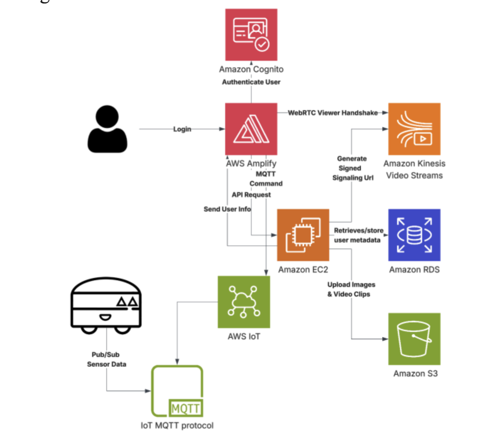

# A-ASMR


**A-ASMR** (AI Autonomous Security Mobile Robot), nicknamed **Sentinex**, is an autonomous security robot designed as a low-cost alternative to traditional surveillance systems and expensive AI security solutions. Built on a full-stack embedded and cloud-based architecture, it enables continuous monitoring, remote control, and real-time event detection—ideal for night patrols and indoor perimeter security.


- ROS2 and micro-ROS for real-time robotic control  
- ESP32 and Jetson Nano for distributed embedded processing  
- FastAPI (Python) backend and a TypeScript-based frontend dashboard  
- AWS infrastructure for streaming, storage, authentication, and control  


## Hardware Overview

The Sentinex robot platform consists of:

- A custom 2-wheel drive chassis designed in Fusion 360
- RPLiDAR A1 for 360° scanning and obstacle detection
- Jetson Nano for onboard AI inference
- Dual ESP32 microcontrollers for motor control, sensor input, and ROS2 integration

CAD files and design assets are located in the [`Mechanical/`](./Mechanical) folder.


## System Overview

<p align="center">
  
</p>


## Repository Structure

```
A-ASMR/
├── Embedded/
│   └── ESP32/                # Micro-ROS firmware and motor/sensor control
├── Mechanical/               # CAD and hardware design documents
├── WebApp/
│   ├── Backend/              # FastAPI backend with AWS integration
│   └── Frontend/             # TypeScript web dashboard
├── Docs/                     # Final report and supporting documents
├── images/                   # Diagrams and supporting visuals
├── README.md
└── .gitignore
```